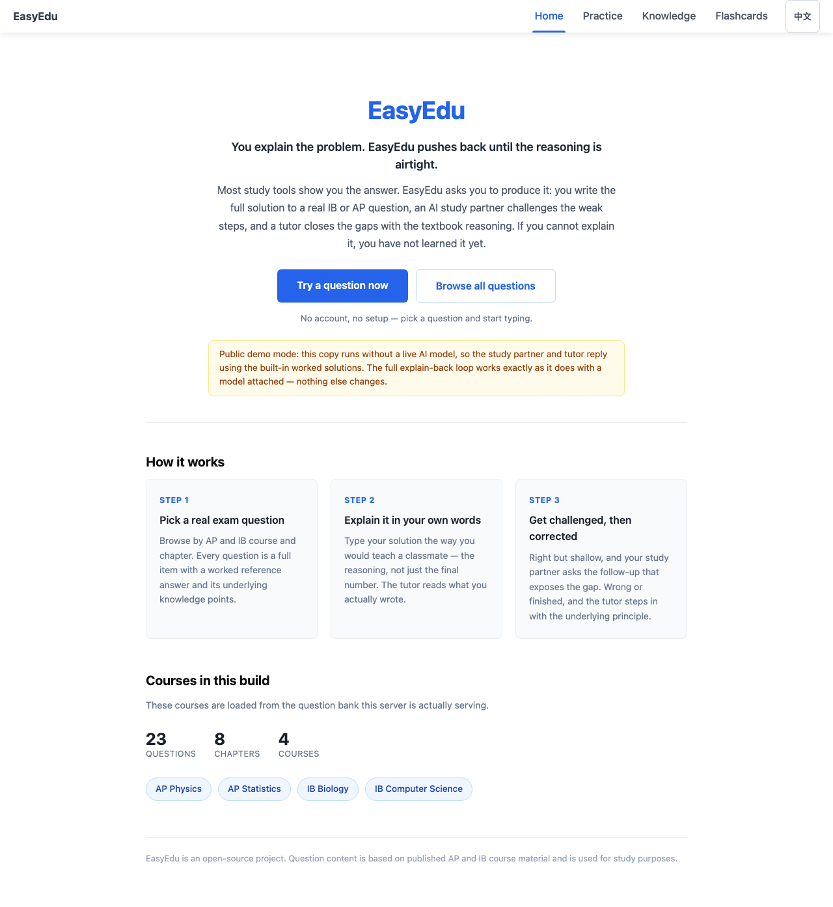
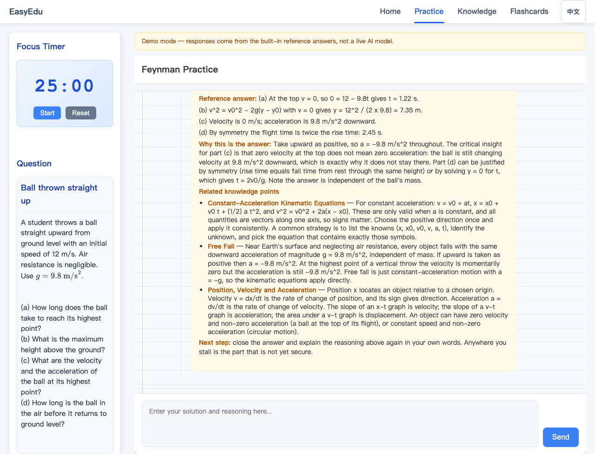
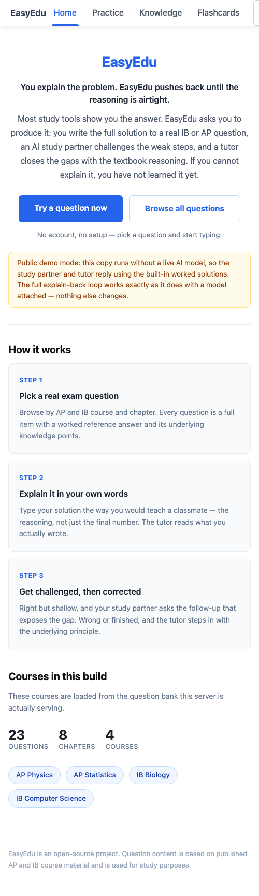

# EasyEdu

**You explain the problem. EasyEdu pushes back until the reasoning is airtight.**

Most study tools show you the answer. EasyEdu asks you to produce it: you write out a
full solution to a real IB or AP question, an AI *study partner* challenges the weak
steps, and a *tutor* closes the gaps with the underlying principle. It is the Feynman
technique turned into software — if you cannot explain it, you have not learned it yet.

**Live demo: <https://easyedu-496b.onrender.com>** — open it and press *Try a question now*.
No account, no API key, nothing to install.

- **[Run it locally in 30 seconds](#run-it-locally)** — no GPU, no API key, no data setup.
- **[Deploy it as a public website](docs/DEPLOY.md)** — one blueprint, one click on Render.

---

## Live demo

**<https://easyedu-496b.onrender.com>**

Nothing to install, no account, no API key. Open the link, press **Try a question now**,
and type an explanation. The service is on Render's free tier, so the first visit after a
quiet period can take 30–60 seconds to wake up.

[](https://render.com/deploy?repo=https://github.com/gordonli0316-afk/EasyEdu)

One click reads [`render.yaml`](render.yaml) and creates the service with the correct
runtime, build command, start command, health check and environment. No settings to fill in.

| Landing page | Explain-back in action | Mobile |
| --- | --- | --- |
|  |  |  |

*(Screenshots captured from this repository running locally, in demo mode.)*

## What it does

1. **Pick a question.** Real AP/IB free-response and multiple-choice items, organised by
   course and chapter, each with a worked reference answer and linked knowledge points.
2. **Explain your reasoning.** You type the solution the way you would teach a classmate.
3. **Get the right kind of pushback.** Three agents decide what you need next:

| Agent | Role | When it runs |
| --- | --- | --- |
| **Router** | Judges whether the explanation is correct and complete | always, first |
| **Student** | A peer who asks the "but why?" follow-up | right, but still surface-level |
| **Teacher** | Corrects the error, or wraps up with the principle and related knowledge points | wrong, or already complete |

Orchestration is a [LangGraph](https://github.com/langchain-ai/langgraph) state machine
(`src/agents/workflow.py`). Model calls go through our own httpx client speaking the
OpenAI-compatible protocol (`src/agents/llm/`), so the same code drives a self-hosted
vLLM model, DeepSeek, or Tongyi.

## Run it locally

```bash
git clone https://github.com/gordonli0316-afk/EasyEdu.git
cd EasyEdu
python3 -m venv .venv && source .venv/bin/activate
pip install -r requirements.txt
bash run_web.sh                     # http://127.0.0.1:8000
```

Open <http://127.0.0.1:8000>. There is nothing else to configure.

**It works with no model attached.** If no model endpoint is reachable — or the key is
rejected, out of credit, rate-limited or the provider fails mid-request — EasyEdu runs in
**demo mode**: replies are assembled from the bundled textbook reference answers with a
rule-based evaluator, and the three-agent flow behaves exactly as it does with a model —
the site never breaks for a visitor. The interface states plainly which mode is active,
and `GET /api/status` reports it. To use real model output, see
[`docs/DEPLOY.md`](docs/DEPLOY.md) §4.

**Questions are included.** `data/seed_courses/` ships a sample bank (4 AP/IB courses,
8 chapters, 23 questions) that is used automatically whenever `data/courses/` — the full
bank generated from textbooks — is empty. See
[`data/seed_courses/README.md`](data/seed_courses/README.md).

## Deploy it as a public website

A reviewer should not need Python, Node, a terminal, a GitHub clone, or an API key.
The recommended path is **Render** using the included `render.yaml` blueprint:

1. Push this repo to GitHub.
2. Render dashboard → **New +** → **Blueprint** → pick the repo.
3. Open the generated `https://<name>.onrender.com` URL and share it.

Full instructions, the Docker alternative, verification commands, environment variables
and troubleshooting are in **[`docs/DEPLOY.md`](docs/DEPLOY.md)**.

## Configuration

Everything is read from environment variables; `.env.example` documents them all.

| Variable | Purpose | Default |
| --- | --- | --- |
| `EASYEDU_LLM_BACKEND` | override the engine: `demo`, `local_vllm`, `deepseek`, `tongyi` | unset — auto-detected, and falls back to `demo` whenever the model is unusable |
| `DEEPSEEK_API_KEY` / `TONGYI_API_KEY` | server-side API key; setting one selects that backend automatically | – |
| `EASYEDU_LLM_BASE_URL` / `EASYEDU_LLM_MODEL` | self-hosted OpenAI-compatible endpoint | `http://127.0.0.1:8000/v1`, `Qwen2.5-7B-Instruct` |
| `PORT` / `EASYEDU_WEB_PORT` | HTTP port | `8000` |
| `EASYEDU_CORS_ORIGINS` | only if the frontend is on another domain | same-origin, no CORS |

No API key is ever exposed to the browser: the frontend only calls `/api/...` on its own
origin and all model traffic is proxied by the FastAPI backend.

## Project layout

```
web/                 FastAPI app: routes, Jinja templates, static JS/CSS
src/agents/          LangGraph workflow, router/student/teacher agents, LLM client
src/agents/demo.py   Offline demo tutor (no model required)
src/services/        Optional: file upload, flashcards, export, video recommendations
data/seed_courses/   Bundled sample question bank (committed, used by default)
data/courses/        Full generated question bank (not committed; takes priority)
scripts/             Data ingestion and training scripts
config/ docs/        Path/model configuration and documentation
```

Other docs: [`docs/ARCHITECTURE.md`](docs/ARCHITECTURE.md),
[`docs/DATA.md`](docs/DATA.md), [`docs/MODEL_SERVING.md`](docs/MODEL_SERVING.md),
[`docs/TRAINING.md`](docs/TRAINING.md), [`docs/AUTODL.md`](docs/AUTODL.md),
[`docs/PROJECT_STRUCTURE.md`](docs/PROJECT_STRUCTURE.md).

## Tech stack

FastAPI + Jinja2 + vanilla HTML/CSS/JS on the frontend, LangGraph for orchestration, a
self-written httpx LLM client against OpenAI-compatible endpoints, and vLLM + QLoRA
(PEFT/bitsandbytes) for self-hosted serving and fine-tuning. No build step, no
JavaScript bundler, no database — the app is one Python process plus static files.

## Generating a full question bank (optional)

The sample bank is enough to use and demo the product. To generate the full bank you
need the textbook PDFs (not in git) and a running model:

```bash
pip install -r requirements-optional.txt
python scripts/ingest_textbooks.py --course all --max-chunks 10   # needs a live model
```

---

## 中文说明

EasyEdu 是一个让学生「给 AI 讲题」的辅导系统，主要面向 IB / AP 国际课程。大多数 AI
辅导是学生提问、AI 给答案；EasyEdu 反过来：你来讲，AI 当那个不停追问的老师。能把一道题
讲明白，才算是真的学会了——这也是费曼学习法的出发点。

学生讲完一道题后，Router 先判断讲得对不对、透不透；讲对了但还停在表面就交给 Student
（爱追问的"同学"），讲错了或已经讲完整就交给 Teacher 纠错或收尾。工作流用 LangGraph
编排，模型层是自己写的调用客户端，默认连本地 vLLM，也可以切到商业 API 兜底。

**公开演示无需任何配置**：仓库自带 `data/seed_courses/` 示例题库（4 门课 / 8 章 / 23 题），
没有模型时会自动进入**演示模式**——用内置参考答案 + 规则评估跑完整的三智能体流程，界面会
明确标注当前模式。部署步骤见 [`docs/DEPLOY.md`](docs/DEPLOY.md)。

## 作者 / License

作者：[gordonli0316-afk](https://github.com/gordonli0316-afk)。内容基础全部由本人完成，
后续老师帮忙微调并给出建议。

项目代码采用 [MIT License](LICENSE) 开源。第三方依赖、模型权重和教材等资源遵循各自的
许可条款。
